# Hotel Management System

> Hotel Management System is a web-based application developed using HTML, CSS, PHP, JS, AJAX, and MySQL. It allows admin and users to manage hotel bookings, rooms, and customer data efficiently. Developed by Vaghela Purvarajsinh as a Semester 3 college project using XAMPP, VS Code, and PhpMyAdmin.

---

## 📷 Image Preview (Step-by-Step Flow)

> ⚠️ All screenshots saved in the `images/` folder of your project directory.

### 1️⃣ Home Page  
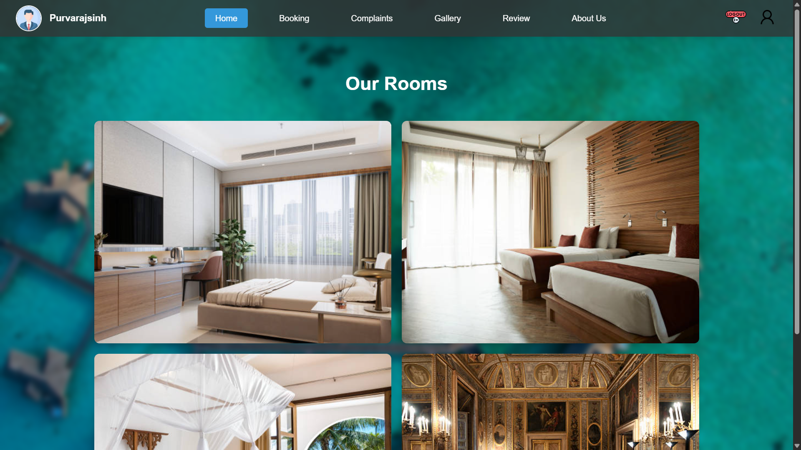

### 2️⃣ User Login  
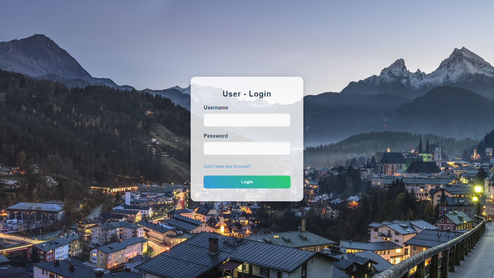

### 3️⃣ New Account / Registration  
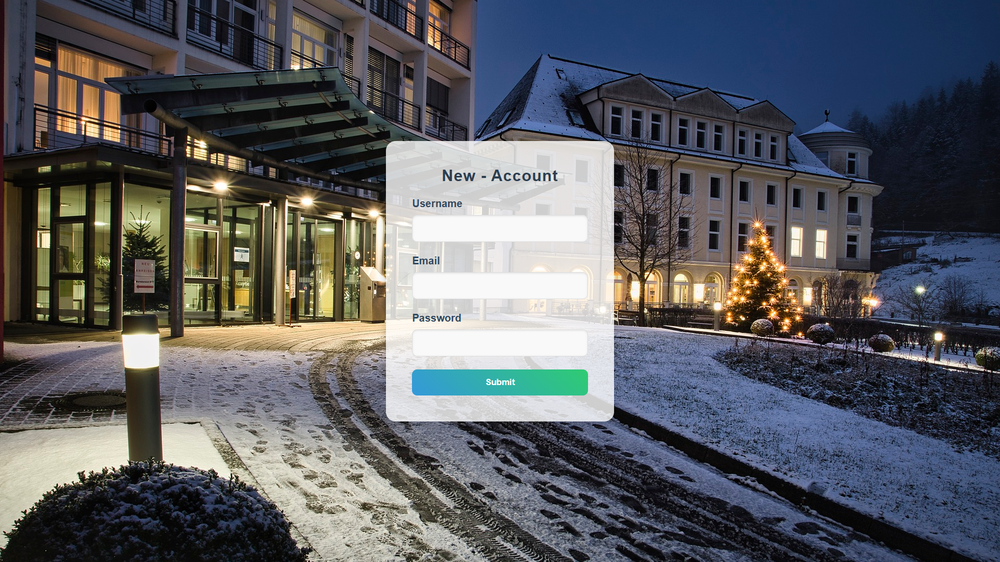

### 5️⃣ About Us Page (User View)  
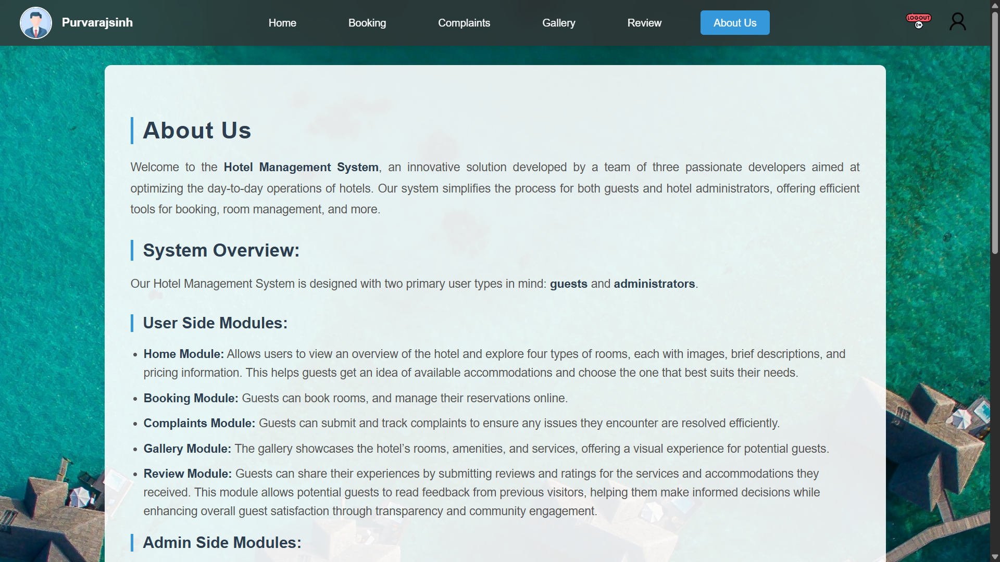  
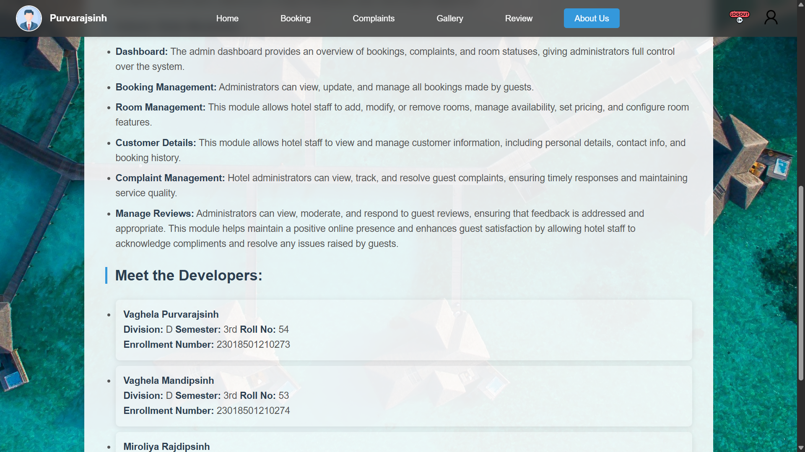

### 6️⃣ Gallery  
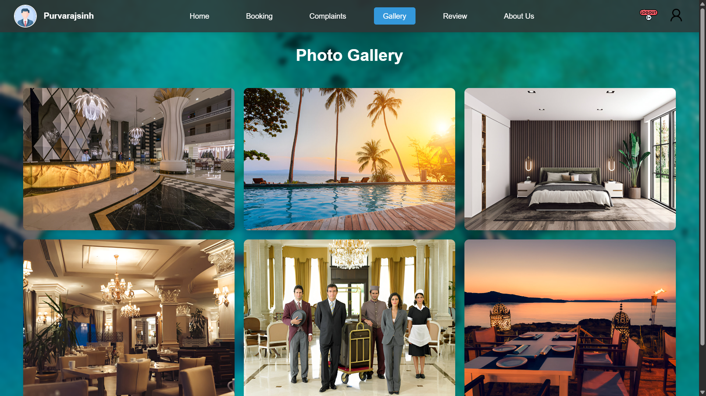

### 7️⃣ Room Reservation / Booking  
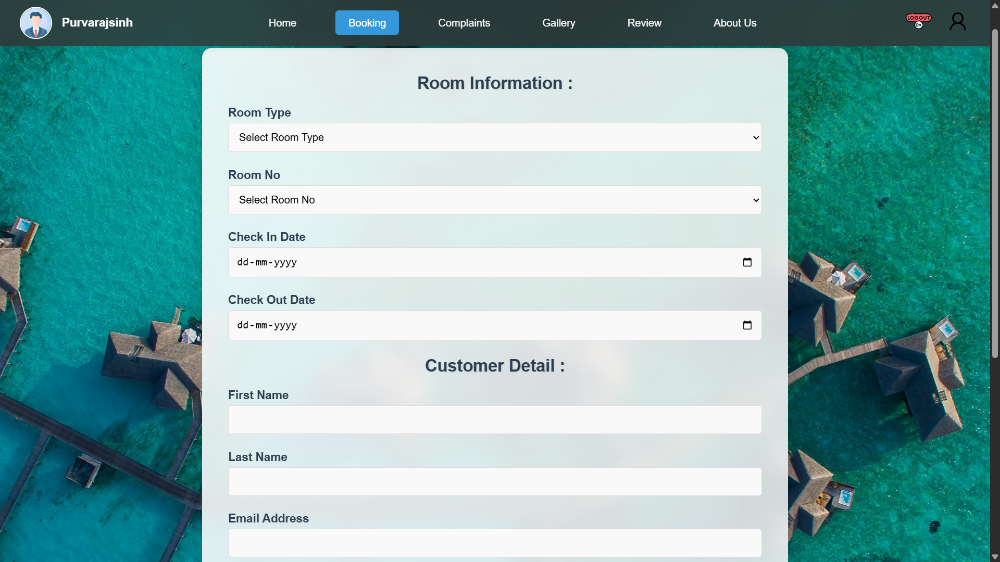  
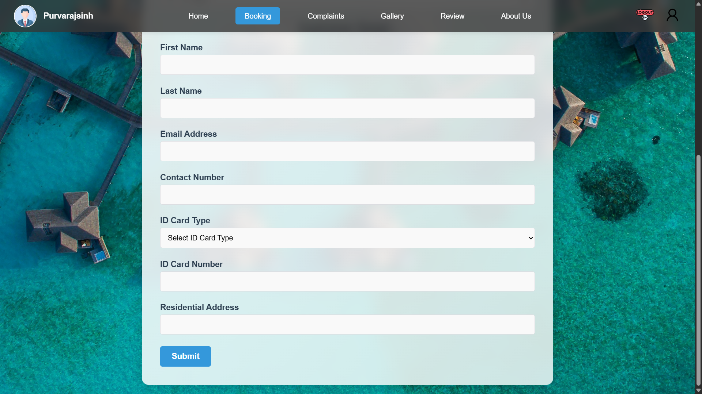

### 8️⃣ Review & Feedback  
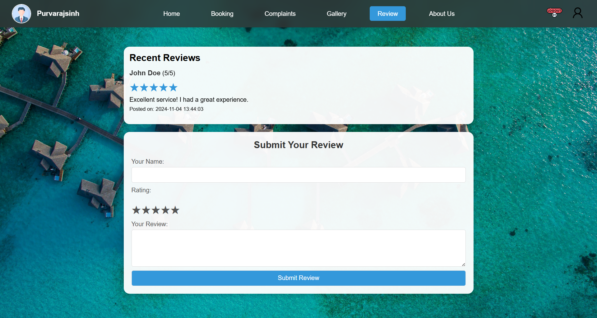

### 9️⃣ Complaint Submission  
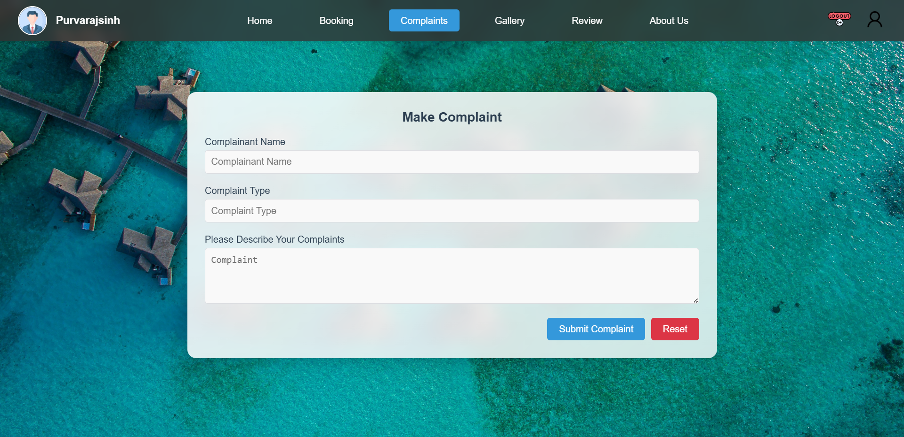

---

### 🔒 Admin Panel

### 1️⃣ Admin Login  
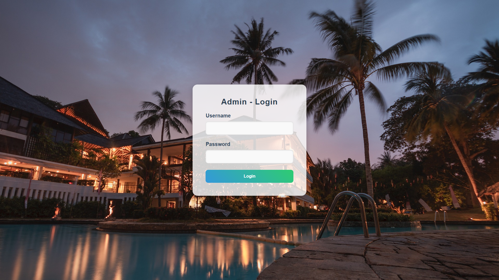

### 2️⃣ Admin Dashboard (Overview)  
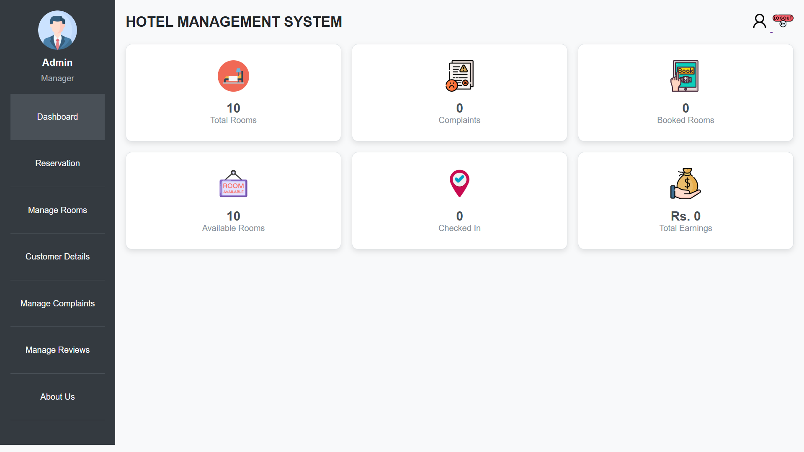

### 3️⃣ About Us Page (Admin View)  
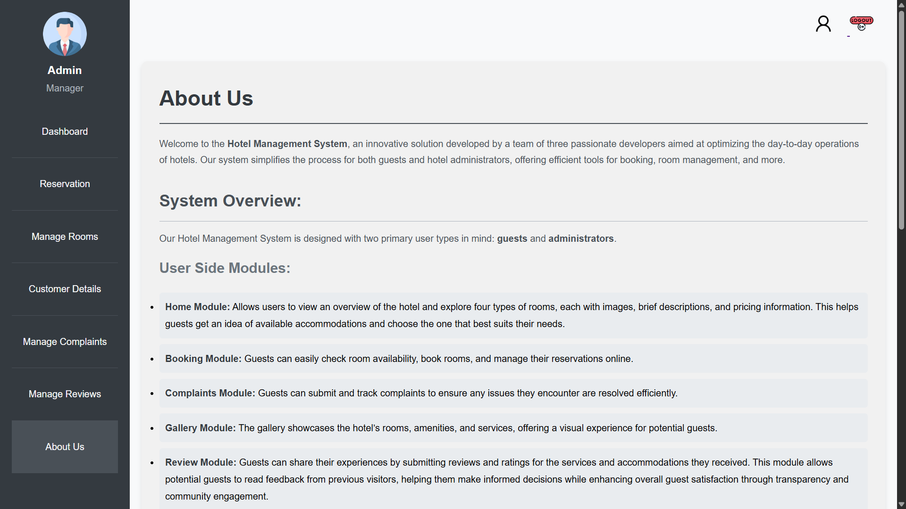

### 4️⃣ Manage Customer Details  
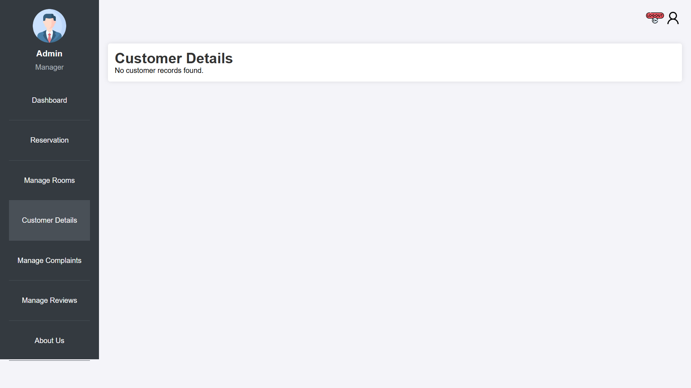

### 5️⃣ Manage Reservations  
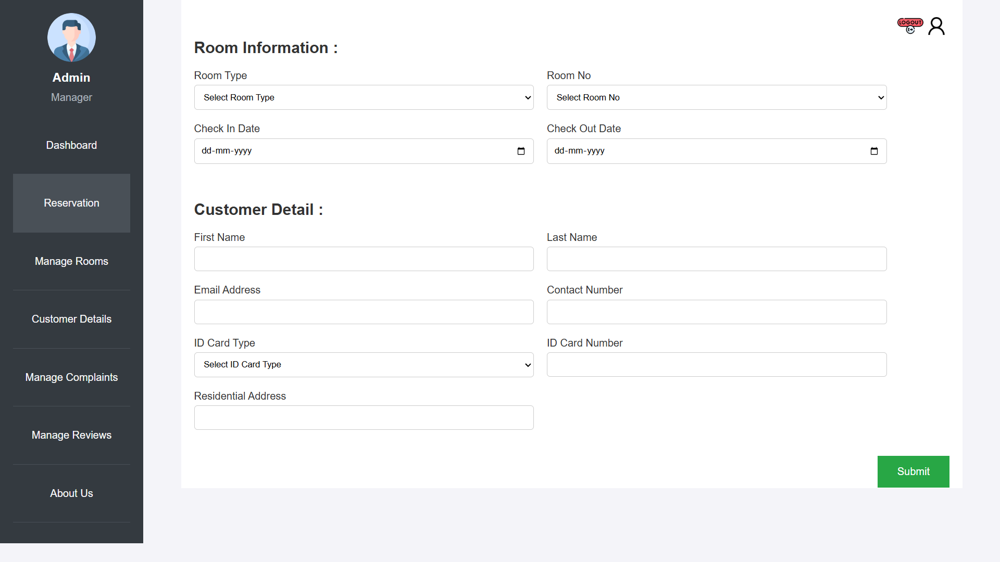

### 6️⃣ Manage Rooms  
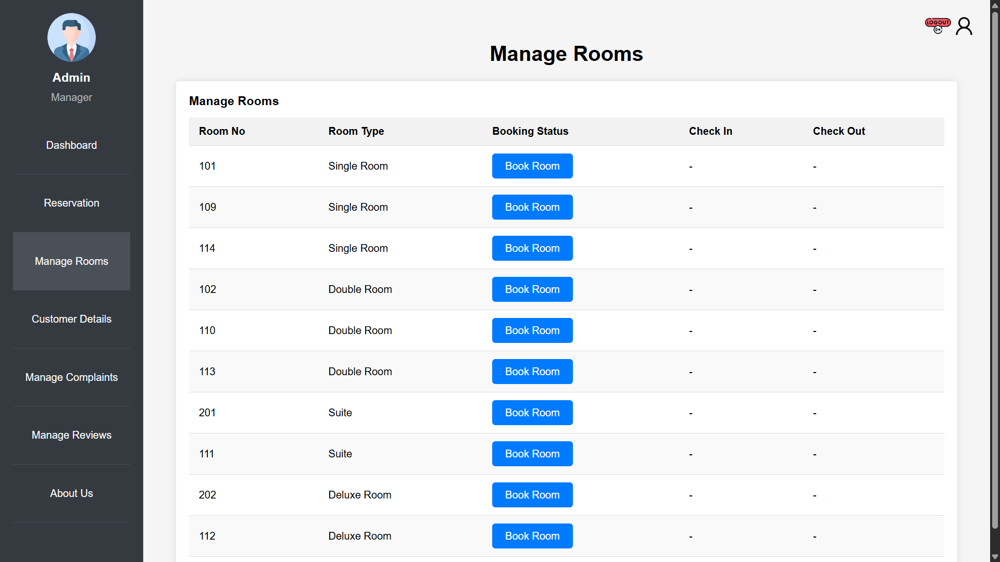

### 7️⃣ Manage Complaints  
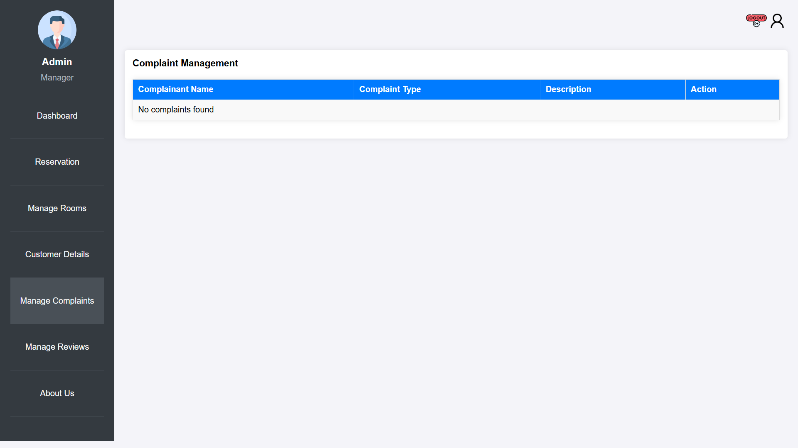

### 8️⃣ Manage Reviews  
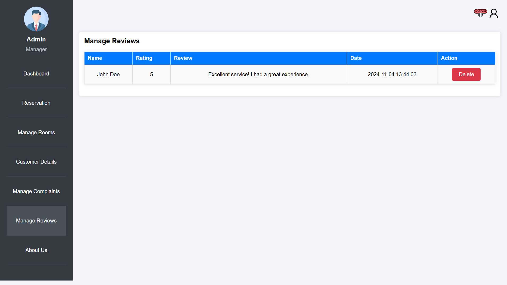

---

## 📁 Project Info

- **Project Name:** Hotel Management System  
- **Developed By:** Vaghela Purvarajsinh (D54)  
- **College Project:** Semester 3

---

## 💻 Software Requirements

- **Code Editor:** VS Code (or any preferred code editor)
- **Server:** XAMPP (Apache, PhpMyAdmin)
- **Browser:** Any (Edge, Chrome, Firefox, etc.)

---

## 🗃️ Database Info

- **Database Name:** `hotel_management`

---

## 👨‍💻 Developer Info

- **Developer:** Vaghela Purvarajsinh

---

## 🔗 References

- **Background Images:** [gettyimages.in](https://www.gettyimages.in/)
- **Icons:** [flaticon.com](https://www.flaticon.com/)
- **Styling Help:** [w3schools.com](https://www.w3schools.com/)
- **Learning Resources:** [geeksforgeeks.org](https://www.geeksforgeeks.org/)

---

## 🔐 Admin Login Details

- **Username:** `Admin`  
- **Password:** `123456`

---

## 👤 User Login Details

- **Username:** `purvarajsinh`  
- **Password:** `12345`

---

## 🚀 How to Run the Project

1. **Install XAMPP** if not already installed.
2. **Create a folder** named `Hotel_Management` in `C:\xampp\htdocs`.
3. **Paste all project files** inside the `Hotel_Management` folder.
4. **Start Apache and MySQL** from the XAMPP Control Panel.
5. **Create a new database**:
   - Open [PhpMyAdmin](http://localhost/phpmyadmin/).
   - Create a database named `hotel_management`.
6. **Import the database**:
   - Select the `hotel_management` database.
   - Go to the **Import** tab.
   - Import the SQL file located in `Hotel_Management/Database`.
7. **Run the project**:
   - Open your browser.
   - Visit: [http://localhost/Hotel_Management](http://localhost/Hotel_Management)
8. **Login** using the provided Admin or User credentials.

---
